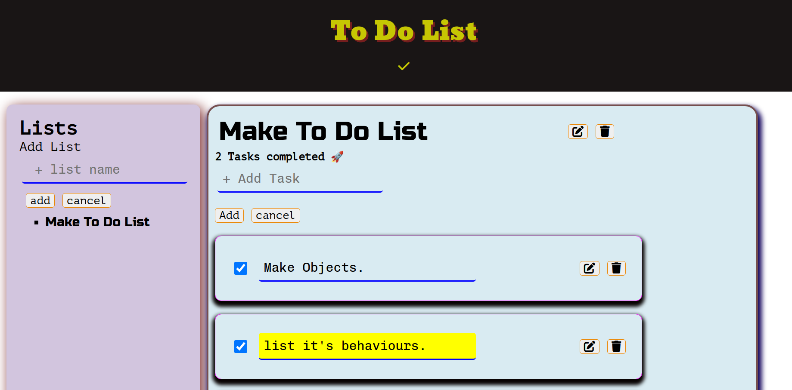
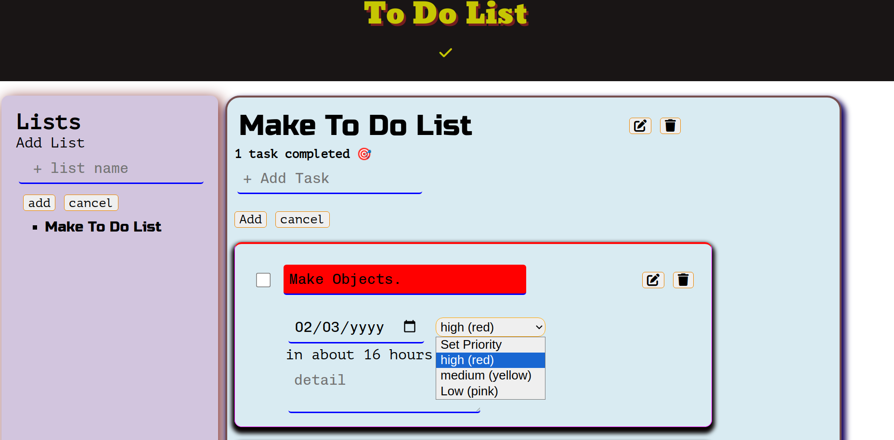

# To Do List
This project was solution for odin project to learn more about oop [https://www.theodinproject.com/lessons/node-path-javascript-todo-list],
# Built with
- HTML ,css ,js and localstorage to store data
# screenshot

# Live Preview link
[https://girma3.github.io/to-do-list/]
# what I learned
-to separeate objects make them less coupled objects to get reused code,
-to detect tightly coupled objects and how to  avoid it,
-SOLID principles of  oop. 
-how to use local storage to store data using Json and use it in js.
-change event on the form input.
-using module help to serparate dom and logic 
# Srtuggled
-at first not able to separate Dom stuff and the logic. because I used to depend much on Dom stuff.
# Continued development
-learn more about oop,use localstorage more effectively,separete dom and logic for the projects.
# helpful materials
-Practical Object-Oriented Design, An Agile Primer Using Ruby
-explain simpliy about solid in oop[https://www.youtube.com/watch?v=q1qKv5TBaOA&ab_channel=Coderized].
-for design inspiration [https://app.todoist.com/app/today] and Gooogle tasks.